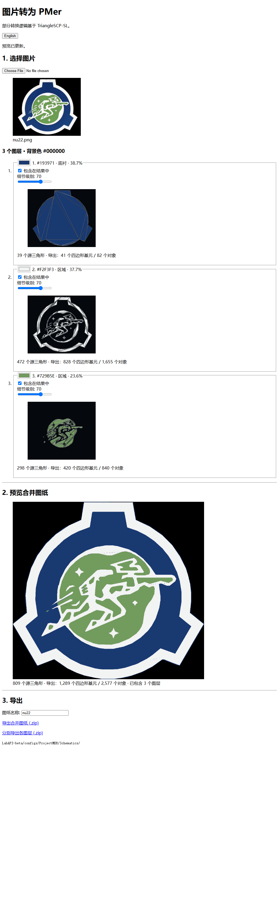
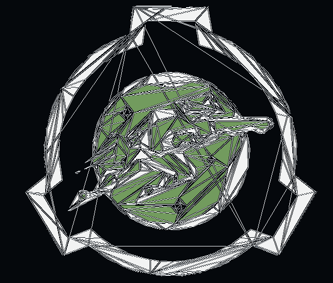

# Image to PMer

**English** · [简体中文](README.md)

Turn an emblem image into a stock SCP:SL ProjectMER schematic: **split layers → tune each layer → preview the clean result → export combined or separate ZIPs**.





The tool runs locally, uses no frontend framework, and deliberately ships with **zero CSS**. The output uses only vanilla ProjectMER empty objects and quad primitives (`BlockType 0` and `BlockType 1`), so it does not require a forked plugin.

## Start in 30 seconds

### Windows

1. Install [Python 3.10+](https://www.python.org/downloads/).
2. Download or clone this repository.
3. Extract the ZIP, then double-click `START.bat`.

The first launch creates an isolated `.venv`, installs the Python packages, and opens `http://127.0.0.1:8731/`. Later launches do not reinstall them.

Maintainers can rebuild the Windows release with `powershell -ExecutionPolicy Bypass -File package-release.ps1`.

### macOS / Linux

```bash
python3 -m pip install -r requirements.txt
python3 webapp/server.py
```

Then open `http://127.0.0.1:8731/`.

## Use it

1. **Split layers:** choose a PNG, JPG, WEBP, or BMP. The colour most common around the image boundary becomes the background; foreground colour layers are detected automatically.
2. **Tune each layer:** every detected colour gets its own detail slider, real triangulation preview, source-triangle count, actual export cost, and **Include in result** checkbox. Export cost shows both visible quad primitives and total ProjectMER objects. Lower values create cheaper geometry; higher values preserve more contour detail. Unchecking a layer excludes it from the combined result and exports without rebuilding geometry.
3. **Preview combined:** inspect the clean stacked ProjectMER result without construction triangles, plus totals for source triangles, quad primitives, and objects across all included layers. Changing any slider immediately hides stale output and shows **Loading…** until every preview is current.
4. **Export:** choose one combined schematic or a ZIP containing one independently loadable schematic folder per layer. Extract either into:

```text
LabAPI-beta/configs/ProjectMER/Schematics/
```

Each layer can spend geometry where it matters. A detailed figure layer can stay near 95 while a smooth backing sits near 20. The tool merges source triangles into convex regions and covers them with vanilla parallelogram primitives, reducing the final runtime object count.

Everything stays on your computer. The server binds to `127.0.0.1` by default and does not upload images to a third party.

## Command line

Automatic layered conversion:

```bash
python tools/layered_emblem_to_mer.py nu22.png \
  --name nu22 \
  --output converted_mer \
  --layer-quality c0=20 \
  --layer-quality c1=70 \
  --layer-quality c2=95 \
  --preview \
  --layer-previews
```

Use a hand-tuned palette and layer order when you need exact art direction:

```bash
python tools/layered_emblem_to_mer.py nu22.png \
  --config examples/nu22.layers.json \
  --name nu22 \
  --output converted_mer \
  --preview
```

Single-colour silhouettes can use the lower-level converter:

```bash
python tools/png_to_mer_schematic.py scarletking.png \
  --name scarletking \
  --output converted_mer \
  --fill-mode ngon \
  --simplify 1.5 \
  --preview
```

Run either script with `--help` for all options.

## How it works

```text
image
  → boundary-aware palette detection
  → smooth sub-pixel contours per colour layer
  → earcut triangulation
  → convex region merging
  → parallelogram cover
  → vanilla ProjectMER JSON
```

ProjectMER has no native triangle primitive. The tool represents non-parallelogram pieces with a transform-hierarchy shear: a rotated child quad under a non-uniformly scaled empty parent produces the required world-space shape. The n-gon path reduces runtime objects by merging adjacent triangles before emitting those quads.

The main modules are:

- `webapp/server.py` — local API, per-layer/combined previews, both ZIP exports, and static page server.
- `webapp/index.html` — the complete zero-CSS UI.
- `tools/trace_svg.py` — palette detection and smooth layered contours.
- `tools/layered_emblem_to_mer.py` — layer stack, per-layer quality mapping, clean previews, and schematic build.
- `tools/mer_ngon_decomposition.py` — triangulation, convex merging, and parallelogram emission.

## Layer configuration

[`examples/nu22.layers.json`](examples/nu22.layers.json) documents the config format. Each layer is:

```json
"green": ["#6D9A57", 2, 0.8, "region"]
```

The values are fill colour, back-to-front order, contour tolerance in pixels, and mode. `region` traces that colour naturally. `silhouette` fills the entire emblem and is useful as a cheap backing layer: detail can show through holes in front layers without requiring its own geometry.

## Development

```bash
python -m pip install -r requirements.txt
python -m unittest discover -s tests -v
python -m py_compile webapp/server.py tools/*.py
```

Contributions and reproducible bug reports are welcome. Please include the source image or a minimal synthetic replacement, each layer's detail value, and the generated object counts.

## License

Source code is [MIT licensed](LICENSE). The bundled SCP-derived example emblems and their converted outputs are available under **CC BY-SA 3.0**; see [NOTICE.md](NOTICE.md). Images you convert keep their original licenses.
